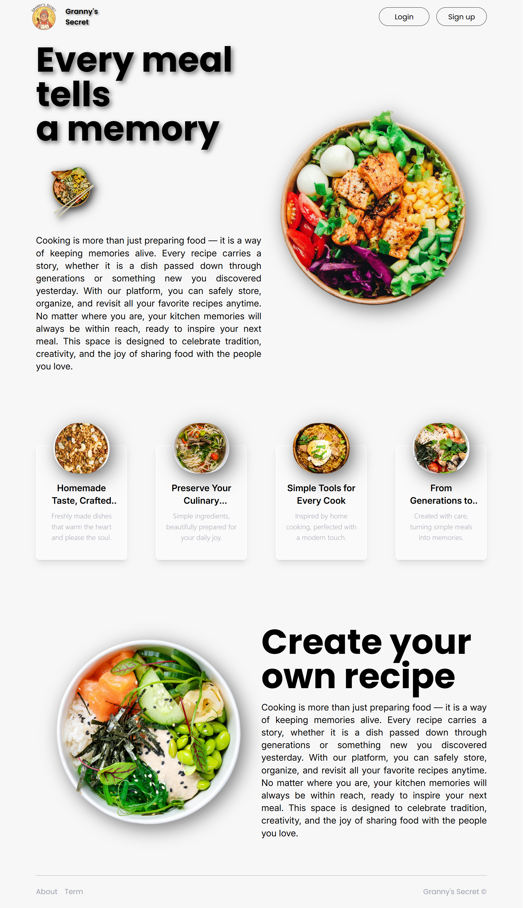
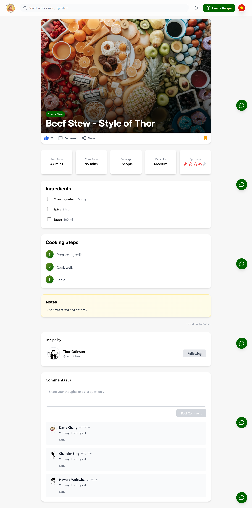
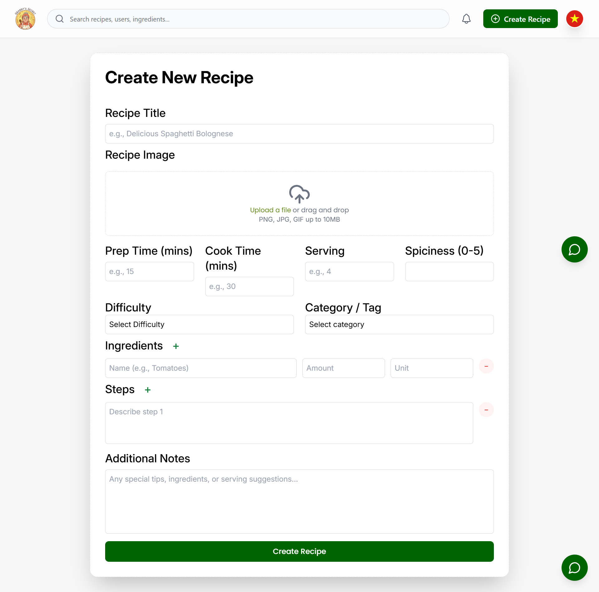
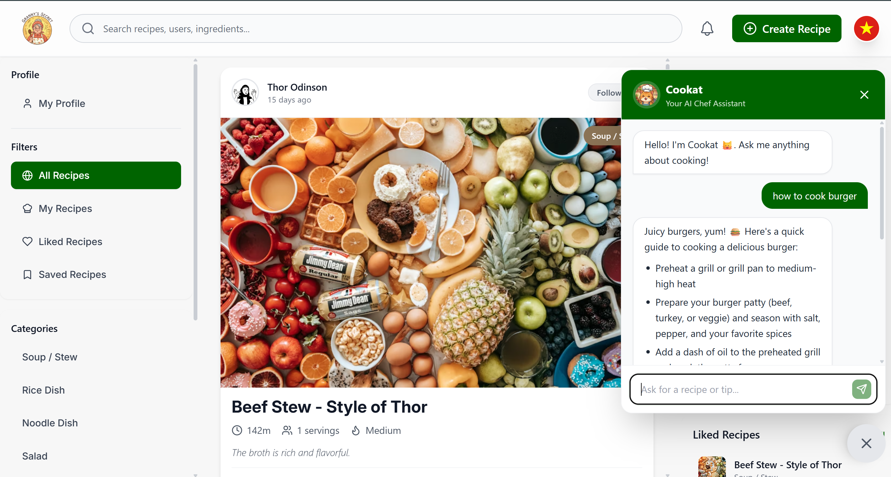
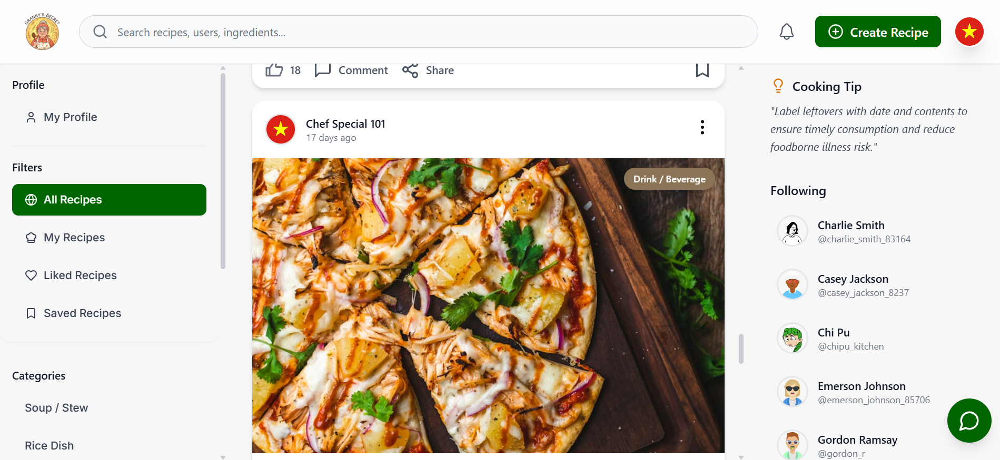
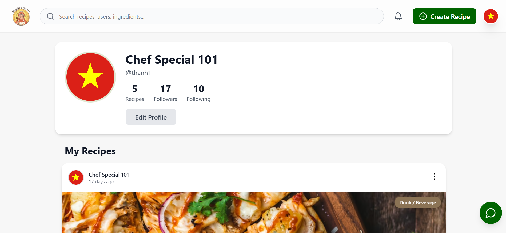
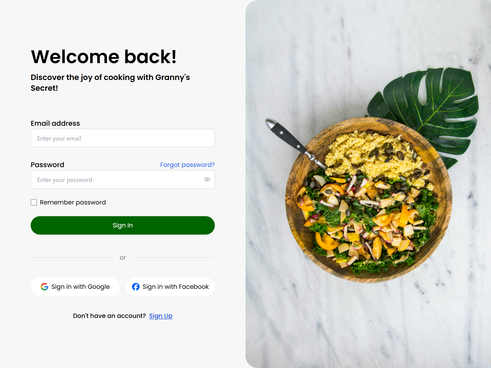
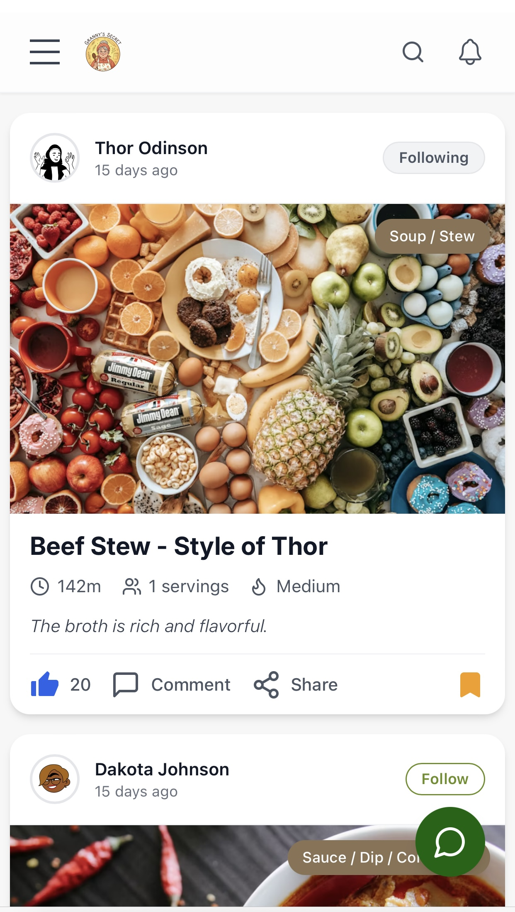

# GrannySecret

GrannySecret is a modern recipe sharing platform that allows users to discover, create, and share their culinary masterpieces. It combines a rich user interface with robust backend services, offering social interactions and AI-powered capabilities to enhance the cooking experience.

## 🚀 Features

- **User Authentication**: Secure Sign Up, Sign In, implementation with JWT, password encryption, and social login capabilities.
- **Recipe Management**: Create, edit, and view detailed recipes with ingredients, instructions, and rich media.
- **Search & Discovery**: Advanced search functionality to find recipes by keywords, categories, or tags.
- **Infinite Scroll**: Seamless browsing experience with auto-loading content.
- **AI Integration**: AI-powered features (via Groq SDK) to assist creating or recommending recipes.
- **User Dashboard**: Personalized dashboard and user profiles to manage recipes and settings.
- **Social Interactions**: Follow users, like recipes, and receive notifications.
- **Responsive Design**: Fully responsive interface built with Tailwind CSS for optimal viewing on all devices.
- **Media Management**: Seamless image uploads and optimization using Cloudinary.
- **Email Notifications**: Integrated email services via SendGrid.

## 📸 Application Preview

### 🏠 Landing Page

<p align="center">
  
</p>

_A modern and welcoming landing page inviting users to explore._

### 🍳 Recipe Management

<p align="center">
  
</p>
<p align="center">
  
</p>

_Detailed recipe views and an intuitive detailed creation form._

### 🤖 AI Chef Assistant

<p align="center">
  
</p>

_Our AI-powered assistant identifying recipes from images and suggesting ideas._

### 👤 User Experience

<p align="center">
  
</p>
<p align="center">
  
</p>

_Personalized dashboard, public profiles._

### 🔐 Authentication

<p align="center">
  
</p>

_Secure and beautiful login screen._

### 📱 Mobile Responsive

<p align="center">
  
</p>

_Fully optimized for mobile devices._

## 🛠️ Technology Stack

### Frontend

- **Framework**: [React 19](https://react.dev/)
- **Styling**: [Tailwind CSS 3.4](https://tailwindcss.com/), PostCSS, Autoprefixer
- **Routing**: [React Router v7](https://reactrouter.com/)
- **State Management & Networking**: Axois, React Hooks
- **UI Components**: React Icons
- **Animations**: AOS (Animate On Scroll)
- **Validation**: Zod
- **Real-time**: Event Source Polyfill (SSE)
- **Markdown Rendering**: React Markdown, Remark Gfm
- **Utilities**: Supabase Client SDK

### Backend

- **Runtime**: [Node.js](https://nodejs.org/)
- **Framework**: [Express 5](https://expressjs.com/)
- **Database**: PostgreSQL
- **ORM**: [Prisma 7](https://www.prisma.io/)
- **Authentication**: JWT (JSON Web Tokens), Bcryptjs
- **Validation**: Zod
- **External Services**:
  - **Cloudinary**: For Image Storage and Management
  - **SendGrid**: For Email Delivery
  - **Groq SDK**: For AI Functionality
  - **Supabase**: Backend Integration
  - **SSE (Server-Sent Events)**: Real-time Notifications

## 📂 Project Structure

```
GrannySecret/
├── client/                 # Frontend React Application
│   ├── src/
│   │   ├── api/            # API Service layer
│   │   ├── components/     # Reusable UI components
│   │   ├── hooks/          # Custom React Hooks
│   │   ├── pages/          # Page components (Dashboard, RecipeDetail, etc.)
│   │   ├── schemas/        # Validation schemas
│   │   └── ...
├── server/                 # Backend Express Application
│   ├── src/
│   │   ├── config/         # App configuration
│   │   ├── controllers/    # Route controllers
│   │   ├── middlewares/    # Express middlewares
│   │   ├── routes/         # API Route definitions
│   │   ├── services/       # Business logic layer
│   │   └── ...
│   ├── prisma/             # Database schema and migrations
└── README.md
```
